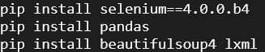

<h1> AJIO Infinite Scroll WebScraping  </h1>
<h2>Description</h2>

   This Python tool tackles the challenge of gathering product details from the AJIO website, which features infinite scrolling, continuously loading more items as users scroll down. This project use Selenium package to automates scrolling, BeautifulSoup4 library and the lxml parser, which scrapes and parses essential data like product names, brands, prices, ratings, and product link from the dynamic AJIO webpage. The scraped data is then neatly organized into a DataFrame with the use of pandas library and exported as a CSV file for convenient access and analysis. This tool effectively streamlines the tedious process of manual data collection, saving considerable time and effort.

<h2>Technologies Used</h2>

<ul>
  <li><b> Python 3: </b>Programming language.</li>
  <li><b> Selenium==4.0.0.b4: </b>Python package used to automate web browser interaction.</li>
  <li><b> BeautifulSoup4: </b> Python library that makes it easy to scrape information from web pages.</li>
  <li><b> lxml: </b> Simple and powerful API for parsing XML and HTML.</li>
  <li><b> Pandas: </b> Python library used for working with data sets such as DataFrames.</li>
  <li><b> Chrome Driver </b> Part of the Selenium package, to automate interactions with the Chrome browser..</li>
</ul>

<h2>Project Outputs</h2>

  <b>
Installing packages for the project:

  
     
     
  <b>
Output(Terminal): Scraped data in the form of Dataframe.

  
     
     
  <b>
Image of scraped data in form of CSV.

  

     
     

        
Thank you  
   ~khushinimawat

    

